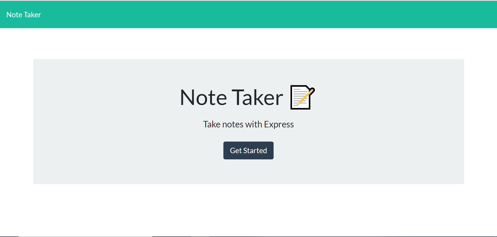
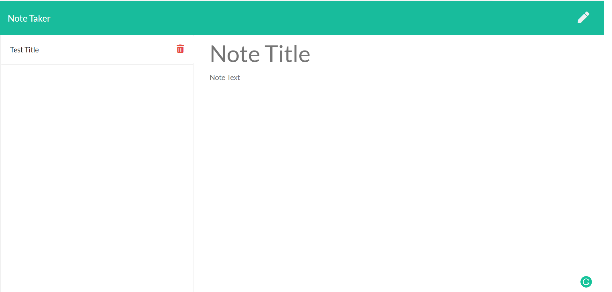
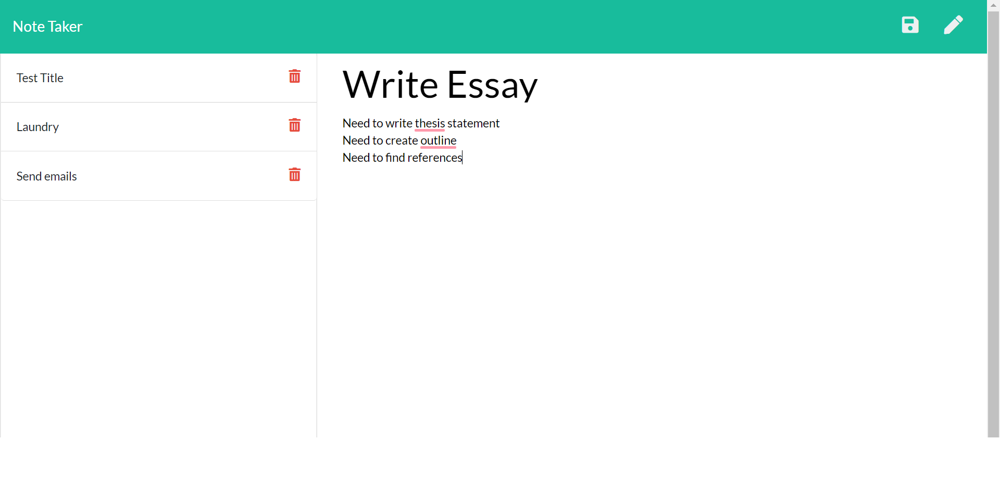

# Note-Taker

  ## Description
  An application that allows user to write, save, and delete notes.
  
  ## Table of Contents
  [Installation](#installation)
  [Usage](#usage)
  [Contact Creator](#contact-creator)
 
  ### Installation
  Node
  
  ### Usage
  Download necessary installations and run serv.js in console or other form of terminal in order to make the App listen on your local port 3000. This is what the homepage you should be viewing looks like: 
  
  

  Next, in order to create and view your notes, you must navigate the the notes.html. To do this, simply click the "Get Started" button on the homepage. You will now see a webpage that looks like this:
  
   
  
  To create notes, simply click in the text boxes labeled "Note Title" and "Note Text" and begin typing. To save, click the file icon in the top right corner (left of the pencil) and you should see a button created on the left side of the page labeled the same as your note title. To view previously created notes, simply click the note on the left that you would like to view. If you would like to create a new note after viewing a note, click the pencil in the top right corner. If you would like to update an existing note, simply view the note and type in the box just like before. Be sure to save the note afterwards by clicking the file icon. To delete notes, click the red trashcan icon on the note you would like to delete.

  This is what your notepage will look like after creating a couple notes:

 

 ### Contact Creator

  #### GitHub Username
  [See GitHub](https://github.com/maxhanson07)

  #### Email Address
  mthanson2@gmail.com

  #### How to reach me
  Shoot me an email.